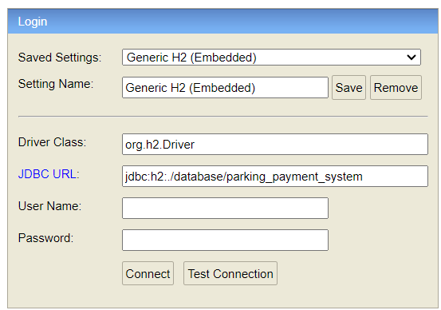

# Parking Payment System

## 1. H2 database

http://localhost:8080/h2-console

Database url can be found in `appplication.properties`.
No username and password required.

If you want to restart with an empty database, delete the file in the folder ./database

## 2. API documentation

### Start parking session

#### Request

`POST http://localhost:8080/parking/start`

    {
        "licensePlate": "2-ABC-123",
        "parking": "00588b89-3030-4c0b-8027-bf631cc28cef"
    }

#### Response

    On success: 202 ACCEPTED 
    On failure: 400 BAD_REQUEST

### Stop parking session

#### Request

`POST http://localhost:8080/parking/stop`

    {
        "licensePlate": "2-ABC-123"
    }

#### Response

    On success: 202 ACCEPTED
    On failure: 404 NOT_FOUND